# Multi Agent Research System

<p align="center">
  <a href="#quickstart">
    
  </a>
  <a href="#architecture">
    
  </a>
  <a href="#configuration">
    
  </a>
</p>

<p align="center">
  
  
  
  
  
</p>

An agentic research assistant that searches the web, extracts source content, drafts a structured report, and then critiques its own output in a simple Streamlit interface.

This project is designed to demonstrate a clean multi-step AI workflow:

- `Search Agent` discovers relevant web sources.
- `Reader Agent` selects and scrapes a promising source.
- `Writer Chain` converts the gathered context into a report.
- `Critic Chain` evaluates the report and returns structured feedback.

## Why This Project

Single-call LLM apps often produce polished answers without showing how evidence was gathered. This system makes the workflow more explicit by separating discovery, reading, writing, and critique into distinct stages.

That separation gives you:

- Better reasoning visibility across the pipeline.
- Easier debugging when a result is weak.
- A more extensible foundation for future agent orchestration.
- A UI that makes the research flow understandable to end users.

## Highlights

- Multi-step research pipeline with distinct responsibilities.
- Streamlit interface for entering topics and viewing outputs.
- Tavily-based search for recent public web results.
- HTML scraping via `requests` and `BeautifulSoup`.
- Gemini-backed report generation and critique.
- Environment-based configuration using `.env`.

## Architecture

```mermaid
flowchart LR
    A["User enters research topic"] --> B["Streamlit UI<br/>app.py"]
    B --> C["Pipeline Orchestrator<br/>pipeline.py"]
    C --> D["Search Agent<br/>web_search tool"]
    D --> E["Search results with title, URL, snippet"]
    E --> F["Reader Agent<br/>scrape_url tool"]
    F --> G["Scraped page content"]
    G --> H["Writer Chain<br/>structured research report"]
    H --> I["Critic Chain<br/>score and feedback"]
    I --> J["Rendered report and critique in UI"]
```



## Repository Structure

```text
.
|-- app.py             # Streamlit application
|-- agents.py          # Agent builders, writer chain, critic chain
|-- pipeline.py        # End-to-end orchestration logic
|-- tools.py           # Tavily search + scraping tools
|-- requirements.txt   # Python dependencies
|-- .env.example       # Example environment variables
|-- .gitignore         # Git hygiene for local-only files
```

## How It Works

### 1. Search Agent

The search stage uses a LangChain agent with the `web_search` tool. That tool calls Tavily and returns a compact bundle of titles, URLs, and snippets.

### 2. Reader Agent

The reader stage receives the search output, chooses a relevant URL, and calls `scrape_url` to fetch page text for deeper grounding.

### 3. Writer Chain

The writer prompt combines:

- Search summaries
- Scraped source content
- The original user topic

It then generates a structured report with:

- Introduction
- Key Findings
- Conclusion
- Sources

### 4. Critic Chain

The critic prompt reviews the generated report and returns:

- A score
- Strengths
- Areas to improve
- A one-line verdict

## Code Analysis

The current implementation is a strong prototype: it is readable, modular, and easy to extend. The separation between UI, orchestration, agent definitions, and tools is especially good for a project at this stage.

### What is working well

- Clear file-level separation of concerns.
- A simple end-to-end agent workflow that is easy to follow.
- Environment-variable based secret handling.
- A user-friendly Streamlit front end.
- Practical use of critique as a second-pass quality check.

### Current limitations

- The reader agent scrapes only one selected source, which can narrow coverage.
- The writer output depends heavily on raw unverified scraped text.
- There is no citation validation beyond URLs included in research context.
- There is no retry, fallback, or error classification for failed tools.
- Logging currently relies on `print`, with no structured observability.
- There are no tests yet for tools, prompts, or orchestration behavior.
- Some UI text appears to have encoding issues and can be cleaned up later.

### High-value next improvements

- Scrape and synthesize multiple sources instead of one.
- Add source ranking, deduplication, and domain quality filters.
- Introduce structured output schemas for report and critique.
- Add caching for Tavily results and page fetches.
- Replace console prints with structured logging.
- Add unit tests for `web_search`, `scrape_url`, and pipeline assembly.
- Add export support for Markdown or PDF research reports.

## Quickstart

### 1. Clone the repository

```bash
git clone https://github.com/<ranjeet22>/multi-agent-research-system.git
cd multi-agent-research-system
```

### 2. Create and activate a virtual environment

Windows PowerShell:

```powershell
python -m venv .venv
.venv\Scripts\Activate.ps1
```

macOS / Linux:

```bash
python3 -m venv .venv
source .venv/bin/activate
```

### 3. Install dependencies

```bash
pip install -r requirements.txt
```

### 4. Configure environment variables

Create a local `.env` file from the template:

```bash
cp .env.example .env
```

Then set your keys:

```env
TAVILY_API_KEY="your_tavily_api_key_here"
GEMINI_API_KEY="your_gemini_api_key_here"
```

### 5. Run the app

```bash
streamlit run app.py
```

Open the local Streamlit URL shown in your terminal, then enter a research topic such as:

- `Impact of AI on healthcare`
- `Future of semiconductor manufacturing`
- `Climate adaptation strategies in coastal cities`

## Configuration

### Required environment variables

| Variable | Required | Description |
|---|---|---|
| `TAVILY_API_KEY` | Yes | Used by the `web_search` tool to discover relevant web sources |
| `GEMINI_API_KEY` | Yes | Used by Gemini through `langchain-google-genai` for report generation and critique |

### Optional model customization

In `agents.py`, the default model is:

```python
model="gemini-2.5-flash-lite"
```

You can swap to another supported Gemini model if your account and package versions allow it.

## Example User Flow

<details>
<summary><strong>Click to expand a sample run</strong></summary>

1. User enters a topic in the Streamlit UI.
2. The search agent retrieves up to five relevant results from Tavily.
3. The reader agent selects and scrapes a relevant URL.
4. The writer chain produces a structured research report.
5. The critic chain scores the report and suggests improvements.
6. The UI displays both the report and the critique in separate expandable sections.

</details>

## Tech Stack

| Layer | Tools |
|---|---|
| UI | Streamlit |
| Agent orchestration | LangChain |
| LLM provider | Google Gemini |
| Search | Tavily |
| Web extraction | Requests, BeautifulSoup |
| Config | python-dotenv |


## License

Add a license before publishing broadly. If you are unsure, `MIT` is a common choice for projects like this.


---

<p align="center">
  Built as an agentic research workflow prototype with Streamlit, LangChain, Tavily, and Gemini.
</p>
